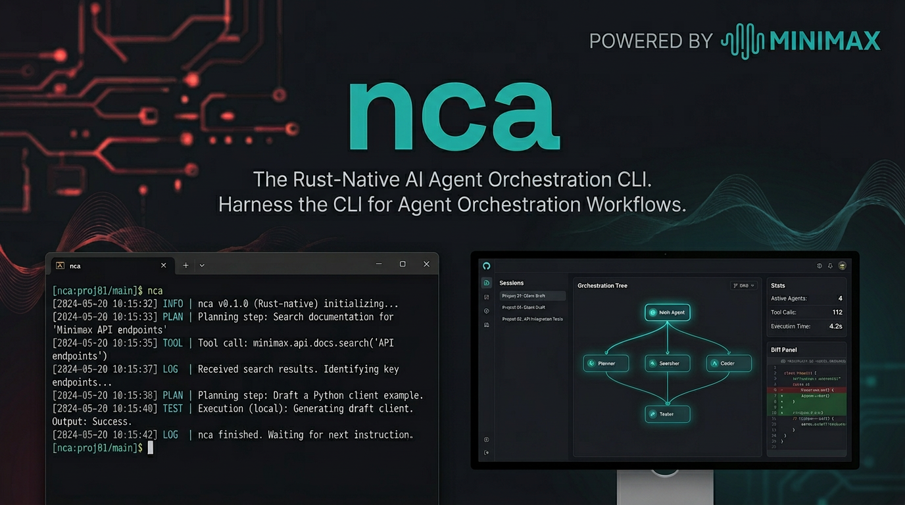

# nca - Native CLI AI



Rust-native AI agent orchestration for people who want a real CLI worker, not another web wrapper.

`nca` is built to harness the CLI as the execution layer for serious agent workflows: run foreground tasks, spawn background sessions, stream machine-readable events, attach later, and supervise everything from a native monitor. No JavaScript, no Electron, no browser dependency, just Rust and a sharp subprocess contract.

## Why Try It

- Rust-native stack from top to bottom.
- MiniMax-first by default, with compatibility for OpenAI, Anthropic/Claude, and OpenRouter.
- Headless-friendly JSON and NDJSON surfaces for orchestration systems.
- Background sessions, event logs, attachable runs, and isolated child-agent worktrees.
- Native desktop monitor with session visibility instead of a bolted-on web dashboard.

## Product Direction

The current focus is not just "a coding CLI."

- `nca` is being shaped into an orchestration-grade CLI worker.
- `nca-monitor` is the native oversight surface for watching, reviewing, and steering those runs.
- `nca-monitor` now supports two desktop directions on the same backend: `Company AI` and `Project AI`.
- The harness is opinionated toward plan-first execution, fail-loud behavior, and structured session lineage.

If you want to wire an agent into a bigger control plane, this repo is aiming directly at that use case.

## Quick Start

This workspace uses Rust edition 2024, so use a recent Rust toolchain first.

```bash
# Build release binaries
cargo build --release

# Install locally
cp target/release/nca /usr/local/bin/
cp target/release/nca-monitor /usr/local/bin/

# Configure MiniMax (default provider)
export MINIMAX_API_KEY="your-api-key"

# Start the interactive CLI
nca

# Run a one-shot task
nca run --prompt "Explain this repository" --stream human

# Spawn a background worker
nca spawn --prompt "Inspect the repo and draft a plan"

# Inspect and attach
nca sessions
nca status <session_id>
nca attach <session_id>

# Launch the native monitor
nca-monitor
```

## Built For Agent Orchestration

`nca` is designed to be launched by other systems, wrappers, and local control planes.

- `nca run --stream off --json` returns a final structured result.
- `nca run --stream ndjson` streams live `EventEnvelope` updates.
- `nca spawn --json`, `status --json`, `sessions --json`, and `cancel --json` give machine-readable lifecycle control.
- `NCA_ORCH_*` environment variables let orchestrators inject run metadata into session state and the harness.
- Headless approval failures fail loudly instead of hanging forever.

Desktop persistence uses a hybrid local-first model:

- `~/.nca/orchestrator.db` for companies, projects, todos, agent profiles, and linked runs
- `<workspace>/.nca/sessions/` for session snapshots and event logs

See [Orchestration Contract](docs/orchestration.md) for the exact subprocess surface.

## Provider Story

- MiniMax is the default and recommended path.
- OpenAI, Anthropic/Claude, and OpenRouter are also supported.
- Config loads from `~/.nca/config.toml`, `.nca/config.local.toml`, and provider-specific environment variables.
- `nca doctor` and `nca models` expose provider readiness and active model selection.

Example provider environment variables:

- `MINIMAX_API_KEY`
- `OPENAI_API_KEY`
- `ANTHROPIC_API_KEY`
- `OPENROUTER_API_KEY`

## Harness Layers

The system prompt is layered so repo defaults stay strong without blocking team or local overrides.

1. Built-in harness prompt
2. Permission mode section
3. Project instructions from `.ncarc`
4. Local instructions from `.nca/instructions.md`
5. Discovered skills summary
6. Orchestration context

You can commit `.ncarc` for shared conventions and keep `.nca/instructions.md` local.

## CLI Surfaces

- Interactive REPL
- One-shot `run`
- Background `spawn`
- Session `resume`
- Event `logs`
- Live `attach`
- Per-session `status`
- `cancel` for spawned work
- Stream modes: `off`, `human`, `ndjson`
- Permission modes: `default`, `plan`, `accept-edits`, `dont-ask`, `bypass-permissions`

## Tools

Current tool-running path supports:

- `read_file`
- `search_code`
- `list_directory`
- `write_file`
- `create_directory`
- `git_status`
- `git_diff`
- `query_symbols`
- `web_search`
- `fetch_url`
- `apply_patch`
- `edit_file`
- `rename_path`
- `move_path`
- `copy_path`
- `delete_path`
- `run_validation`
- `execute_bash`

## Workspace Layout

| Crate | Description |
|-------|-------------|
| `crates/common` | Shared types, config, events |
| `crates/core` | Agent loop, provider abstraction, harness, tools |
| `crates/runtime` | IPC, session lifecycle, persistence, worktree/runtime glue |
| `crates/cli` | Terminal entrypoint and machine-facing control plane |
| `crates/monitor` | Native egui monitor for supervising sessions |

## Documentation

- [Product Requirements](docs/prd.md)
- [Tech Stack](docs/tech-stack.md)
- [Architecture](docs/architecture.md)
- [Orchestration Contract](docs/orchestration.md)

## License

MIT
