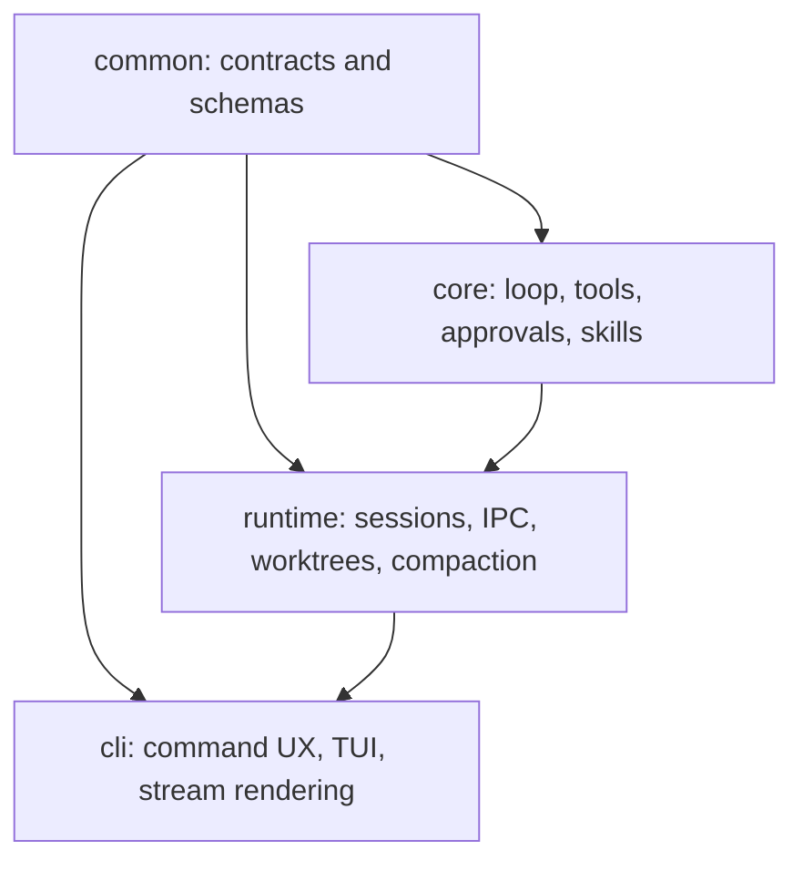

# Claude Code To NCA Adoption Map

## Goal

Translate the strongest Claude Code patterns into a concrete Rust-native roadmap for `nca`, using the existing crate boundaries instead of importing upstream structure directly.

## Current Strengths In `nca`

`nca` already has the right skeleton for this work:

- shared event contracts in [`crates/common/src/event.rs`](../../crates/common/src/event.rs)
- shared session metadata in [`crates/common/src/session.rs`](../../crates/common/src/session.rs)
- a centralized tool registry in [`crates/core/src/tools/mod.rs`](../../crates/core/src/tools/mod.rs)
- a simple model-driven agent loop in [`crates/core/src/agent.rs`](../../crates/core/src/agent.rs)
- permission policy and approval handling in [`crates/core/src/approval.rs`](../../crates/core/src/approval.rs)
- hooks in [`crates/core/src/hooks.rs`](../../crates/core/src/hooks.rs)
- resumable supervised sessions in [`crates/runtime/src/supervisor.rs`](../../crates/runtime/src/supervisor.rs)
- context stats and compaction in [`crates/runtime/src/context_manager.rs`](../../crates/runtime/src/context_manager.rs)
- worktree-backed delegation in [`crates/runtime/src/worktree.rs`](../../crates/runtime/src/worktree.rs)
- a CLI/runtime split already documented in [`docs/architecture.md`](../architecture.md) and [`docs/orchestration.md`](../orchestration.md)

This means the adoption problem is mostly product and workflow refinement, not a ground-up rewrite.

## Pattern Map

| Claude Code pattern | What `nca` already has | Gap to close | Primary files to touch |
| --- | --- | --- | --- |
| Strong slash-command UX | `clap` command surface and TUI slash list | Slash commands are present, but many of them are closer to labels than deep operator workflows | [`crates/cli/src/main.rs`](../../crates/cli/src/main.rs), [`crates/cli/src/slash_commands.rs`](../../crates/cli/src/slash_commands.rs), `crates/cli/src/repl.rs`, `crates/cli/src/tui/` |
| Tool contract as a product surface | `ToolRegistry`, `ToolDefinition`, `ToolExecutor` | Tool metadata is still thin compared with Claude Code's richer aliases, capability phrases, progress data, and dynamic refresh | [`crates/core/src/tools/mod.rs`](../../crates/core/src/tools/mod.rs), [`crates/common/src/tool.rs`](../../crates/common/src/tool.rs), [`crates/core/src/agent.rs`](../../crates/core/src/agent.rs) |
| Layered permissions | rule-based `ApprovalPolicy`, interactive approvals, hooks | Current policy is good but still simpler than a full ask/allow/deny/audit/sandbox stack | [`crates/core/src/approval.rs`](../../crates/core/src/approval.rs), [`crates/core/src/hooks.rs`](../../crates/core/src/hooks.rs), [`crates/common/src/config.rs`](../../crates/common/src/config.rs), `crates/runtime/src/bash_tool.rs` |
| Compaction as visible UX | `ContextManager`, events, config docs | `nca` compacts and warns, but could surface stronger operator guidance and session-quality recovery patterns | [`crates/runtime/src/context_manager.rs`](../../crates/runtime/src/context_manager.rs), [`crates/runtime/src/supervisor.rs`](../../crates/runtime/src/supervisor.rs), [`docs/context-management.md`](../context-management.md), `crates/cli/src/stream.rs` |
| Subagents for isolation | worktree-backed subagents and child-session events | Delegation exists, but the user-facing control and summary model can be stronger | [`crates/core/src/tools/spawn_subagent.rs`](../../crates/core/src/tools/spawn_subagent.rs), [`crates/runtime/src/worktree.rs`](../../crates/runtime/src/worktree.rs), [`crates/runtime/src/supervisor.rs`](../../crates/runtime/src/supervisor.rs), [`crates/common/src/event.rs`](../../crates/common/src/event.rs) |
| MCP at scale | MCP tool loading already exists | `nca` currently eagerly loads tools per server; this will not scale well for large MCP fleets | [`crates/core/src/tools/mcp.rs`](../../crates/core/src/tools/mcp.rs), [`crates/core/src/tools/mod.rs`](../../crates/core/src/tools/mod.rs), [`crates/common/src/tool.rs`](../../crates/common/src/tool.rs) |
| Persistent session operator controls | resume, attach, logs, status, sessions | The mechanics are strong; the next step is richer session summaries and discoverability | [`crates/runtime/src/supervisor.rs`](../../crates/runtime/src/supervisor.rs), [`crates/runtime/src/session_store.rs`](../../crates/runtime/src/session_store.rs), [`crates/cli/src/main.rs`](../../crates/cli/src/main.rs) |
| Bridge/runtime separation | runtime socket + NDJSON events | `nca` already has the right shape; the opportunity is to formalize more bridge-grade semantics | [`crates/runtime/src/ipc.rs`](../../crates/runtime/src/ipc.rs), [`crates/common/src/event.rs`](../../crates/common/src/event.rs), [`docs/orchestration.md`](../orchestration.md) |
| Skills and task framing | filesystem and `AGENTS.md` skill loading | Skill packaging is good; the next step is making skills more visible and more tightly integrated with session flow | [`crates/core/src/skills.rs`](../../crates/core/src/skills.rs), [`crates/core/src/tools/invoke_skill.rs`](../../crates/core/src/tools/invoke_skill.rs), [`crates/cli/src/main.rs`](../../crates/cli/src/main.rs) |

## Recommended Architecture Direction

Keep `nca` on the current crate split and deepen each boundary:

That architecture is already good enough. The roadmap is about stronger behavior inside each layer.

## Priority Roadmap

### Phase 1: Command And Session UX

Why first:

- fastest user-visible improvement
- low architecture risk
- builds on systems `nca` already has

Concrete moves:

- turn `/compact`, `/cost`, `/sessions`, `/logs`, `/attach`, `/permissions`, and `/review` into more explicit workflows instead of just labels or thin wrappers
- improve resume/startup UX with session summary previews, branch/worktree hints, and last-action context
- surface clearer child-session summaries in the transcript and sidebar when subagents finish

Primary files:

- [`crates/cli/src/main.rs`](../../crates/cli/src/main.rs)
- [`crates/cli/src/slash_commands.rs`](../../crates/cli/src/slash_commands.rs)
- `crates/cli/src/repl.rs`
- `crates/cli/src/tui/app.rs`
- `crates/cli/src/tui/state.rs`
- `crates/cli/src/stream.rs`

### Phase 2: Permission Layer Hardening

Why second:

- Claude Code's biggest production edge is safe autonomy
- `nca` already has the right base abstractions

Concrete moves:

- split permission evaluation into clearer layers: static rules, session allow rules, hook decisions, and approval fallback
- add better descriptions and risk categories for tool prompts
- introduce explicit "always ask" patterns alongside allow/deny
- tighten bash execution controls and define the future sandbox contract

Primary files:

- [`crates/core/src/approval.rs`](../../crates/core/src/approval.rs)
- [`crates/core/src/hooks.rs`](../../crates/core/src/hooks.rs)
- [`crates/common/src/config.rs`](../../crates/common/src/config.rs)
- `crates/runtime/src/bash_tool.rs`

### Phase 3: Context Hygiene And Recovery

Why third:

- long-running coding sessions degrade in predictable ways
- `nca` already emits the right event types, so this is mostly a control-surface problem

Concrete moves:

- expose context-pressure thresholds more clearly in the CLI
- add a stronger manual compact/handoff workflow before automatic summarization fires
- preserve or summarize tool results more selectively instead of treating all prior context similarly
- emit richer compaction events so users know what changed and why

Primary files:

- [`crates/runtime/src/context_manager.rs`](../../crates/runtime/src/context_manager.rs)
- [`crates/runtime/src/supervisor.rs`](../../crates/runtime/src/supervisor.rs)
- [`docs/context-management.md`](../context-management.md)
- `crates/cli/src/stream.rs`

### Phase 4: MCP Tool Search And Deferred Loading

Why fourth:

- this is one of the clearest architectural wins from Claude Code
- it becomes more important as `nca` users add bigger MCP catalogs

Concrete moves:

- stop eagerly registering every MCP tool up front
- add a lightweight MCP search/discovery tool or deferred capability index
- load full tool schemas only when selected or when the model proves need
- cache server tool manifests across sessions where safe

Primary files:

- [`crates/core/src/tools/mcp.rs`](../../crates/core/src/tools/mcp.rs)
- [`crates/core/src/tools/mod.rs`](../../crates/core/src/tools/mod.rs)
- [`crates/common/src/tool.rs`](../../crates/common/src/tool.rs)

### Phase 5: Bridge And Headless Runtime Consolidation

Why fifth:

- the current runtime/IPC design is already strong
- the next gains come from formalization, not reinvention

Concrete moves:

- make more of the socket protocol explicitly bridge-safe and versioned
- enrich event envelopes with optional machine-friendly metadata for external clients
- align attach/logs/status/headless behavior more tightly so all frontends see the same session story

Primary files:

- [`crates/runtime/src/ipc.rs`](../../crates/runtime/src/ipc.rs)
- [`crates/common/src/event.rs`](../../crates/common/src/event.rs)
- [`crates/runtime/src/supervisor.rs`](../../crates/runtime/src/supervisor.rs)
- [`docs/orchestration.md`](../orchestration.md)

## Deprioritized Or Not Worth Copying

These should stay out of the first adoption wave:

- React/Ink-style UI architecture
- feature-flag-heavy monolith patterns
- mobile/desktop-specific surfaces
- broad plugin infrastructure before the CLI/runtime product surfaces are sharper
- remote-first workflows before local session control feels excellent

## Suggested Implementation Order

1. Command and session UX
2. Permission-layer hardening
3. Context hygiene improvements
4. MCP lazy loading/tool search
5. Bridge/runtime protocol formalization

This order delivers visible CLI value early, reduces risk, and avoids prematurely expanding architectural scope.

## Bottom Line

Claude Code validates the direction `nca` is already on:

- simple model-driven loop
- strong typed tools
- resumable sessions
- subagent isolation
- runtime/CLI separation

The biggest opportunity is to make those systems feel more intentional and production-grade at the product surface, especially around commands, permissions, compaction, and MCP scaling.
